# Automate Terraform with GitHub Actions

This repo is a companion repo to the [Automate Terraform with GitHub Actions tutorial](https://developer.hashicorp.com/terraform/tutorials/automation/github-actions).

#### - Login AWS
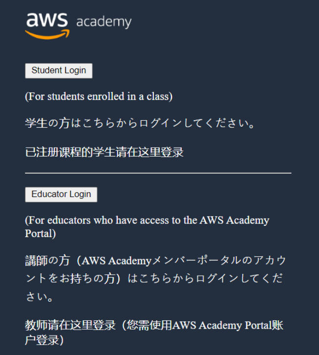

#### - Acesso LearnerLab
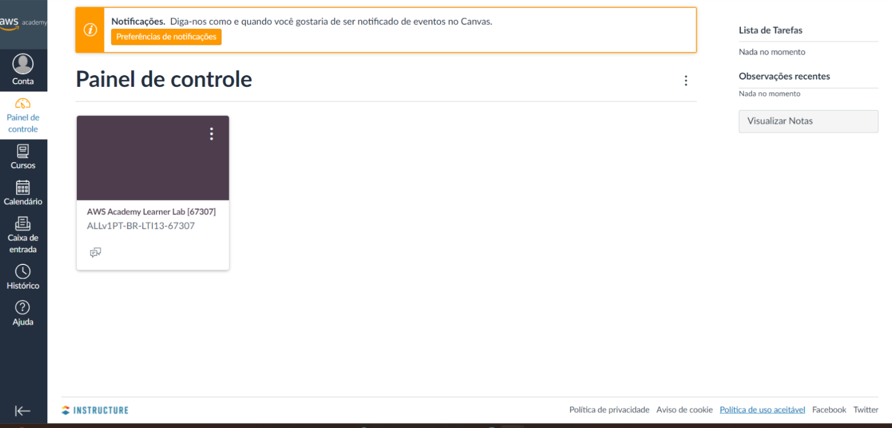

#### - Criar conta Terraform

#### - Terraform - New Organization
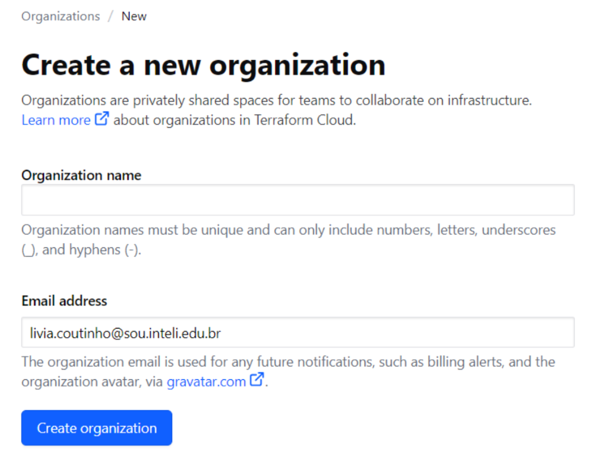

#### - Terraform - New Workspace
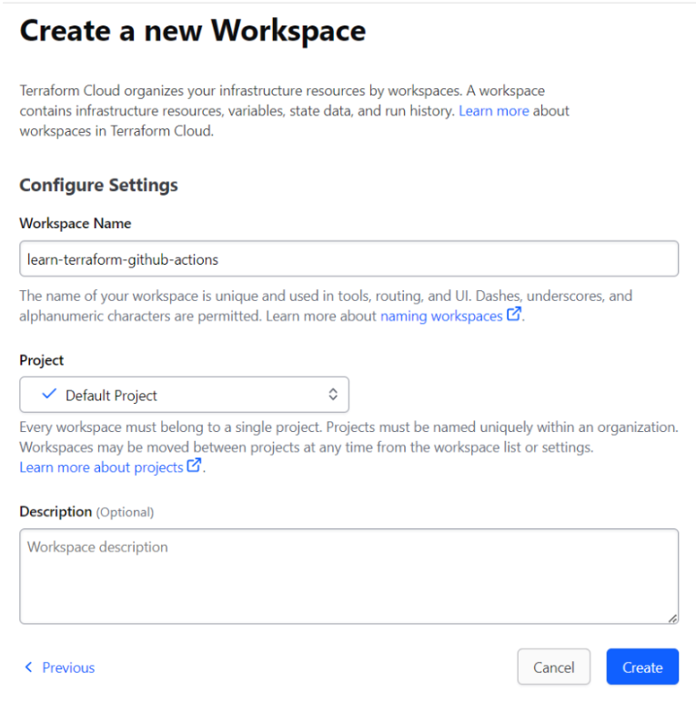

#### - AWS - Start Lab (para pegar as variáveis)
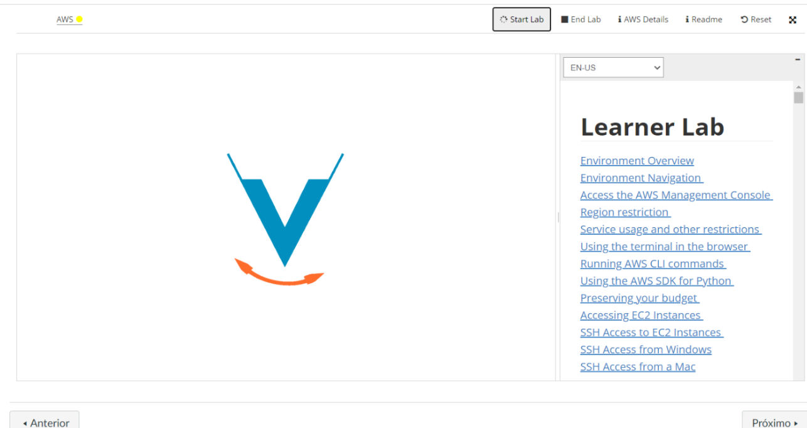

#### - Terraform - Definir as variáveis
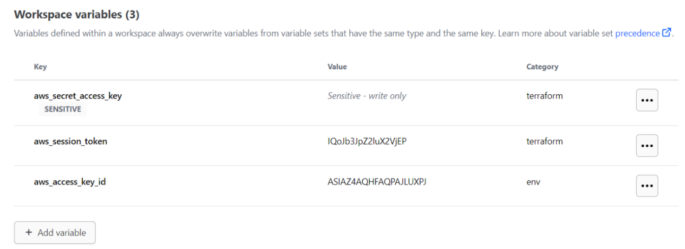

#### - Terraform - Criar Token
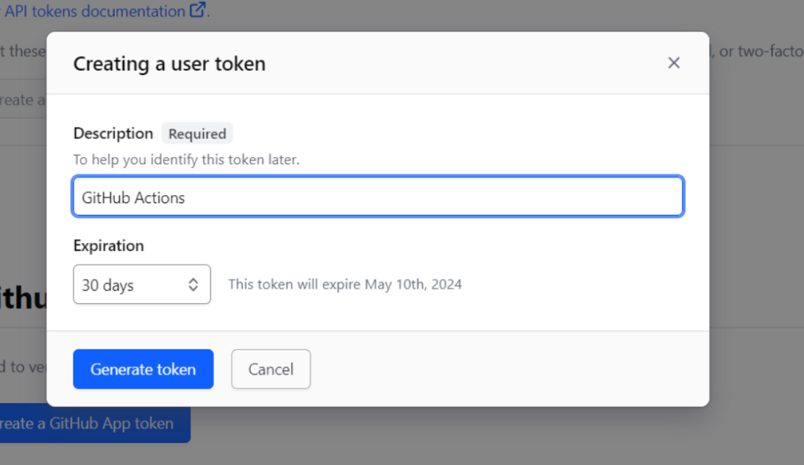
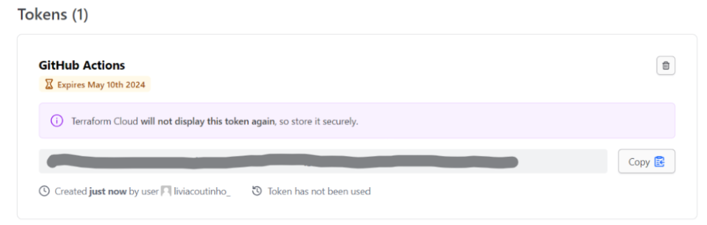

#### - Github - Novo repositório
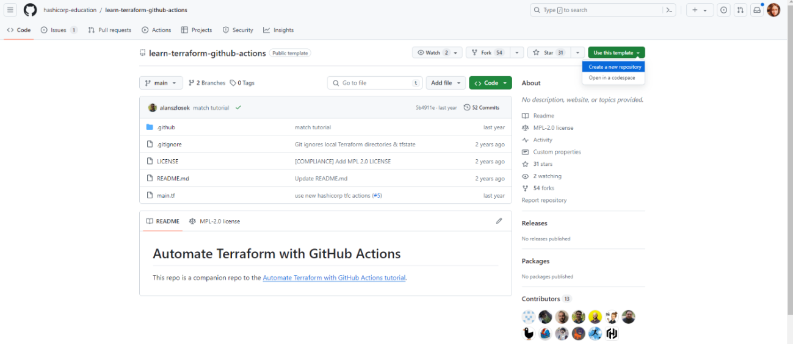

#### - Github - Secrets and Variables
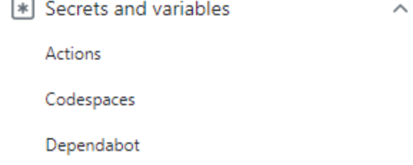
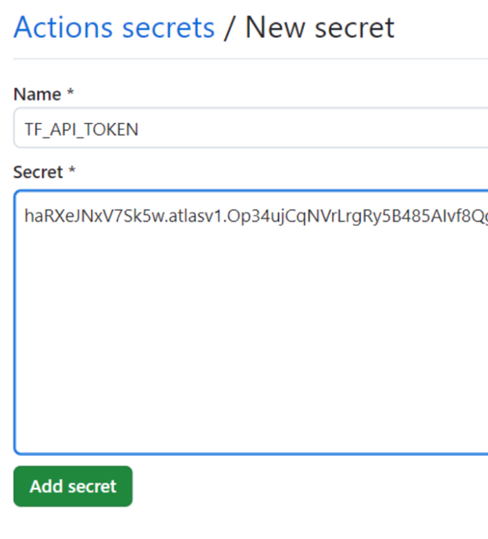

#### - Clonar repositório para a máquina local
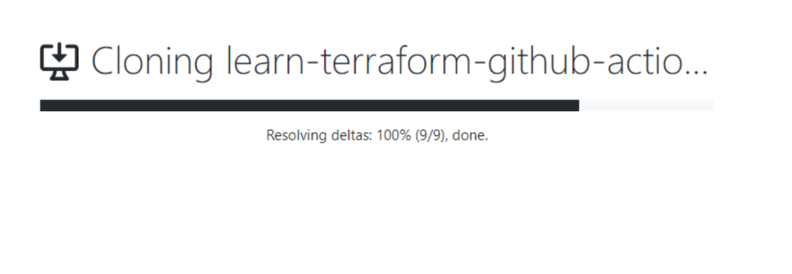

#### - terraform-plan.yml
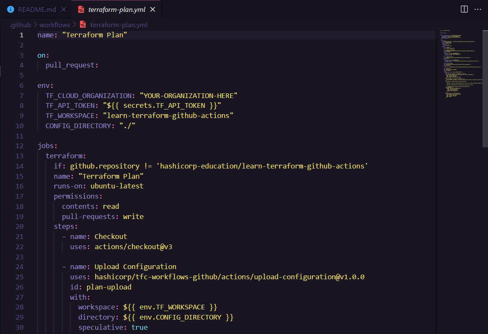

#### - terraform-apply.yml
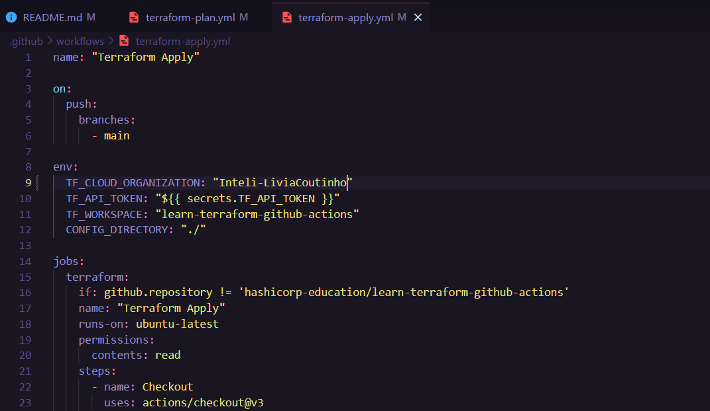

#### Trocar região no arquivo main.tf
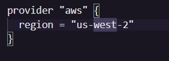
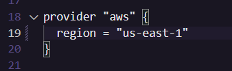

#### - git checkout -b 'update-tfc-org'
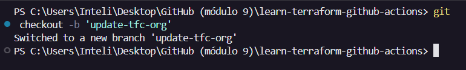

#### - git add .github/workflows
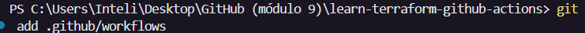

#### - git commit -m 'Use our Terraform Cloud organization'
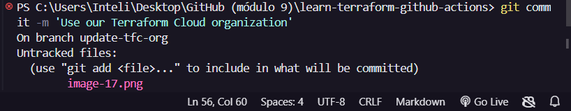
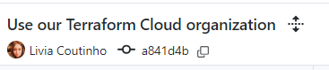

#### - git push origin update-tfc-org
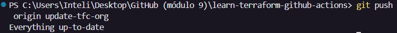

#### - Pull requests
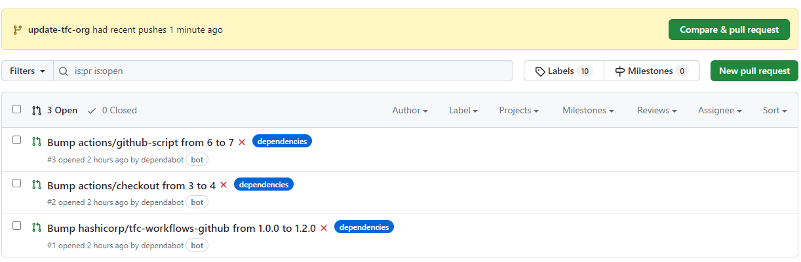
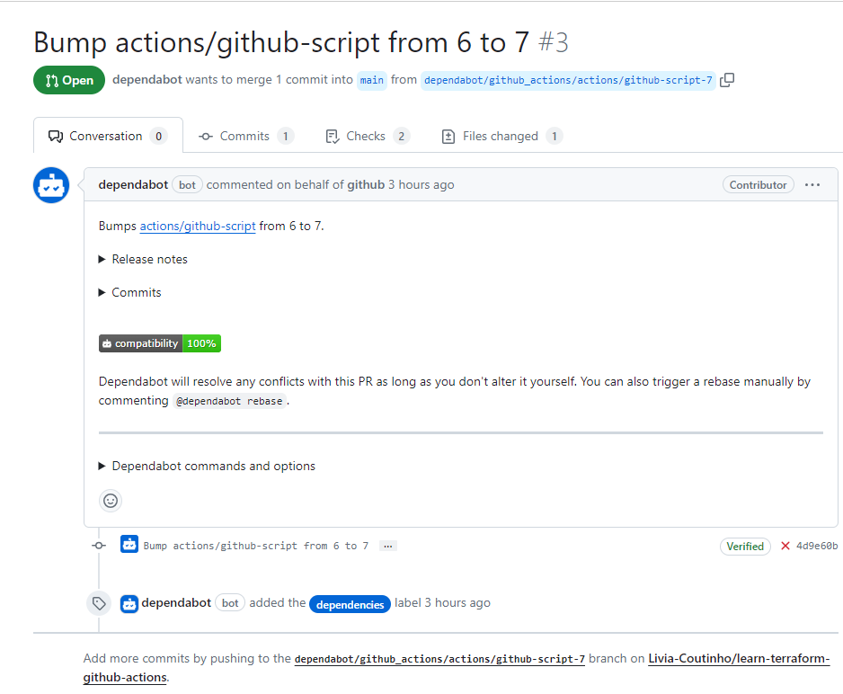
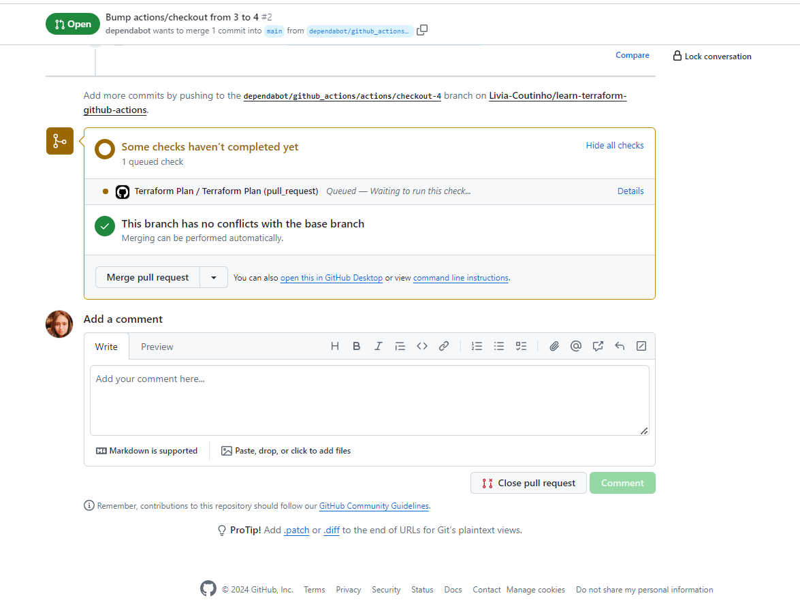