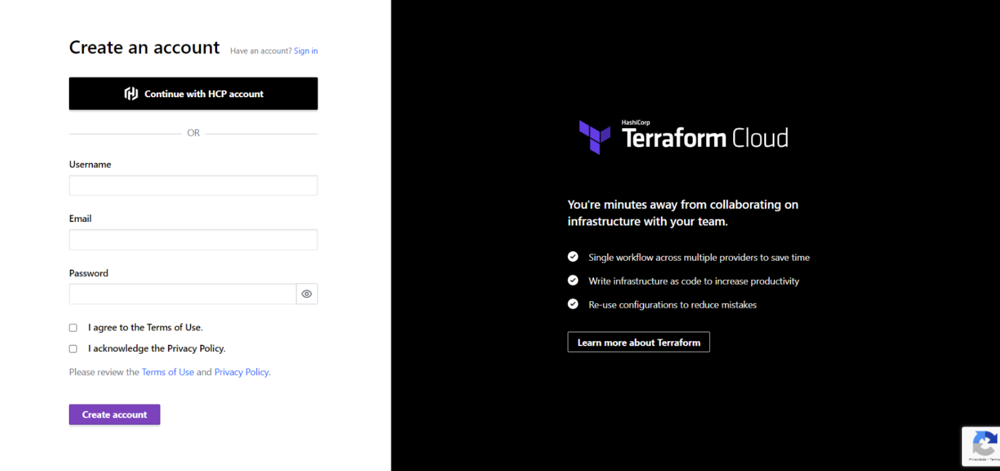

# Automate Terraform with GitHub Actions

This repo is a companion repo to the [Automate Terraform with GitHub Actions tutorial](https://developer.hashicorp.com/terraform/tutorials/automation/github-actions).

#### - Login AWS

#### - Acesso LearnerLab

#### - Criar conta Terraform

#### - Terraform - New Organization

#### - Terraform - New Workspace

#### AWS - Start Lab (para pegar as variáveis)

#### Terraform - Definir as variáveis

#### Terraform - Criar Token

#### Github - Novo repositório

#### Github - Secrets and Variables

#### Clonar repositório para a máquina local

